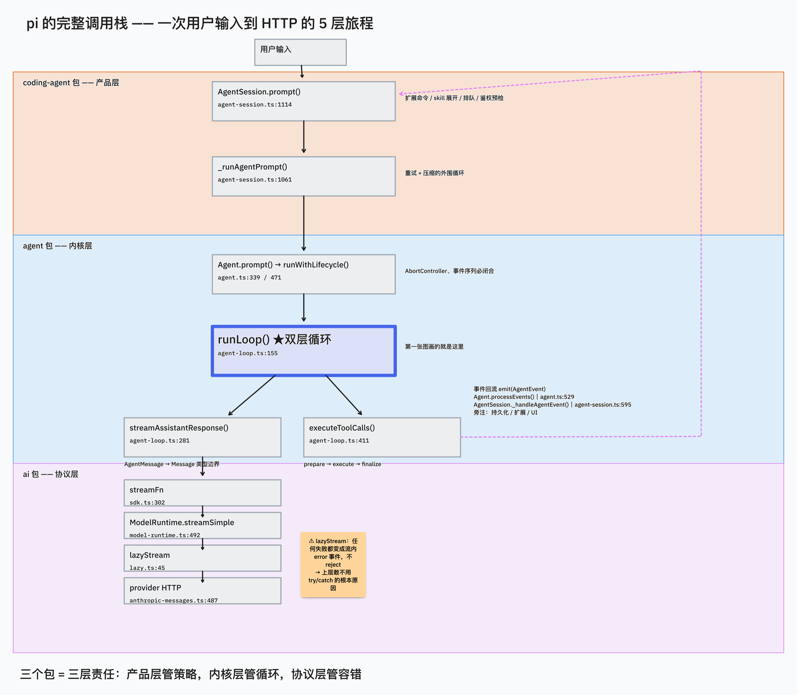
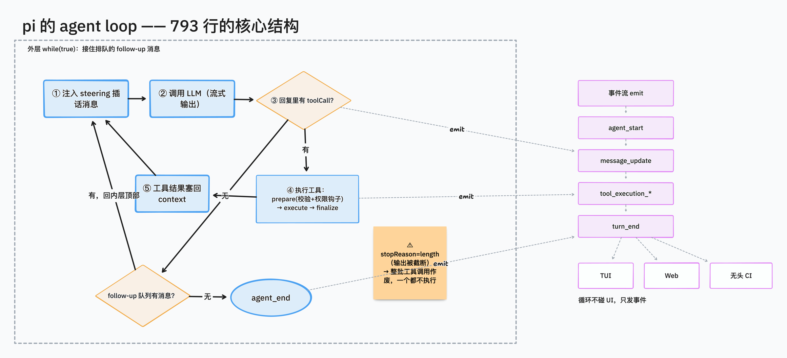

# 研读笔记 01：pi 的 agent loop

> 主源码：[packages/agent/src/agent-loop.ts](https://github.com/earendil-works/pi/blob/main/packages/agent/src/agent-loop.ts)（792 行）
> 基于 pi commit `2efa728d`（2026-07-27），pi-agent-core 0.82.1；文中行号以该 commit 为准
> 二读补充（7/28）：从 `AgentSession` 到 provider HTTP 的**跨包完整链路**，见下方「完整调用栈」与「逐层拆解」

## 一句话总结

pi 把"agent"实现为一个**双层 while 循环 + 事件流**：内层循环处理工具调用和用户插话，外层循环处理"agent 本该停下但用户又排队了新消息"的续跑；整个过程中 loop 不直接操作 UI，只往外 emit 事件。

**二读后的补充判断**：这 792 行之所以能这么干净，是因为它把三件事**推出去**了——错误处理推给了下层的流协议、状态维护推给了上层的 `Agent`、重试与压缩策略推给了更上层的 `AgentSession`。文章 1 的真正立意应该是**"如何设计一个不承担额外责任的内核"**，而不只是"agent 就是个 while 循环"。

## 完整调用栈（跨 5 层，二读补充）

```
用户输入
  ↓
AgentSession.prompt()                  coding-agent/src/core/agent-session.ts:1114
  │  扩展命令 / skill / 模板展开 / 排队 / 鉴权预检 / before_agent_start
  ↓
AgentSession._runAgentPrompt()         agent-session.ts:1061   ← 外层：重试 + 压缩循环
  ↓
Agent.prompt()                         agent/src/agent.ts:339
  └→ runWithLifecycle()                agent.ts:471            ← AbortController + isStreaming
  ↓
runAgentLoop()                         agent/src/agent-loop.ts:95
  └→ runLoop()                         agent-loop.ts:155       ← ★ 双层循环
       ├→ streamAssistantResponse()    agent-loop.ts:281       ← AgentMessage→Message 边界
       │    └→ streamFn                coding-agent/src/core/sdk.ts:302
       │         └→ ModelRuntime.streamSimple()  model-runtime.ts:492  ← 注入 auth/headers
       │              └→ lazyStream()  ai/src/api/lazy.ts:45
       │                   └→ provider.streamSimple → ai/src/api/anthropic-messages.ts:487
       └→ executeToolCalls()           agent-loop.ts:411
            prepare → execute → finalize
  ↓
事件回流 emit(AgentEvent)
  └→ Agent.processEvents()             agent.ts:529            ← 内部状态归约
       └→ AgentSession._handleAgentEvent()  agent-session.ts:595 ← 持久化 / 扩展 / UI
```



这张图同时解释了为什么 pi 分成三个包：产品层管策略，内核层管循环，协议层管容错。

## 核心结构（runLoop, L155-275）

```
外层 while(true)                        ← 处理 follow-up 消息（排队的后续任务）
  内层 while(有工具调用 || 有插话消息)
    1. 注入 pending 的 steering 消息      ← 用户在 agent 干活时插的话
    2. streamAssistantResponse()          ← 唯一一次 LLM 调用/轮
    3. 收集 message 里的 toolCall
    4. executeToolCalls()                 ← 串行或并行执行
    5. 工具结果 push 回 context
    6. prepareNextTurn / shouldStopAfterTurn 钩子
    7. 再取一次 steering 消息
  内层退出 → 取 follow-up 消息，有就 continue，没有就 break
emit(agent_end)
```



**steering 与 followUp 的本质区别**就是轮询点位置不同：steering 在内层（L259，每个 turn 后插队），followUp 在外层（L263，agent 彻底没事干了才生效）。两个队列的取数策略由 `QueueMode` 控制（`agent.ts:139`）：`"all"` 一次全倒，`"one-at-a-time"` 每次只取最老一条（默认）。

## 逐层拆解（二读补充）

### 第 1 层 `AgentSession.prompt()` —— 送进循环前的所有事
`agent-session.ts:1114`，完全不碰 LLM：扩展命令优先执行并短路 → `input` 事件（扩展可 `handled`/`transform`）→ 展开 `/skill:` 与 prompt 模板 → **正在流式则入队而非新建 run**（L1159）→ 验模型/验鉴权 → `_checkCompaction` 兜住上一轮被中断的溢出 → 组 user message → `before_agent_start`（扩展可整体替换 systemPrompt）。

> 教学点：**"同一时刻只有一个 run"** 是理解整个交互模型的前提。运行中的输入不是新 run，是入队。

### 第 2 层 `Agent` —— 状态机与生命周期
`runWithLifecycle`（`agent.ts:471`）建立 run 边界：AbortController、isStreaming、activeRun。关键是 `handleRunFailure`（`agent.ts:496`）：**即使循环内部抛异常，也伪造一条 error/aborted 的 assistant message，补发 message_start/message_end/turn_end/agent_end 四个事件**。

> 教学点：订阅者看到的事件序列在任何路径下都闭合——这是上层 UI 和持久化能写得极简的前提。mini-agent 必须抄这个不变式。

### 第 4 层 `streamAssistantResponse` —— 类型边界（L281）
`transformContext`（L291）→ `convertToLlm`（L295）→ 组 `Context` → `getApiKey` **每轮重新解析**（L305，为了应付长工具执行期间过期的 OAuth token）。

消费流的处理很巧（L317-360）：`start` 事件时把**半成品消息直接 push 进 context 末尾**（L321），每个 delta 事件**原地替换**（L337），`done/error` 时用 final 覆盖（L350）。好处是中断时 context 里天然留着已生成的部分，不需要额外暂存区。发给监听者的是浅拷贝 `{...partialMessage}`，避免 UI 拿到会被改写的引用。

### 第 5 层 到 HTTP —— 错误契约的落地点
`sdk.ts:302` 注入 streamFn（合并超时/重试、挂 `transformHeaders`、挂 `onPayload`/`onResponse` 给扩展改 payload）→ `ModelRuntime.streamSimple`（`model-runtime.ts:492`）解析 credential/OAuth/baseUrl → `lazyStream`（`ai/src/api/lazy.ts:45`）：

```ts
export function lazyStream(model, setup) {
    const outer = new AssistantMessageEventStream();
    setup().then((inner) => forwardStream(outer, inner))
           .catch((error) => {                       // ★ 任何 setup 失败
               const message = createSetupErrorMessage(model, error);
               outer.push({ type: "error", reason: "error", error: message });
               outer.end(message);                    // 变成流里的 error 事件，不 reject
           });
    return outer;                                     // 同步返回，异步 setup 藏在背后
}
```

> **这是整篇文章最值得讲的一段。** 它是 `ai/src/types.ts:305` 那段契约注释（"一旦调用就不抛异常"）的实现，也是上层循环敢用 `stopReason` 而不是 try/catch 做分支的根本原因。

### 第 8 层 `_handlePostAgentRun` —— 循环之外的循环
`agent-session.ts:1061`：
```ts
await this.agent.prompt(messages);
while (await this._handlePostAgentRun()) { await this.agent.continue(); }
```
`agent_end` 之后再问一句"真的完了吗"（L1075）：可重试错误 → 重跑；上下文溢出/超阈值 → 压缩后重跑；`agent_end` 钩子里新塞的消息 → 续跑。

`_checkCompaction`（L1953）的边界处理值得单独讲：跳过用户主动中断、跳过换模型后的陈旧溢出（`sameModel`，L1966）、跳过压缩边界之前的旧消息（L1972，防止刚压完又被老 usage 触发）、溢出恢复只允许一次（L1990）、重试前把错误消息从 agent state 摘掉但**保留在 session 文件里**（L2006）。→ 文章 4 的主素材。

## 值得写进文章的设计点

### A. 内核层面（一读已记，保留）

**1. Agent = 循环，不是框架魔法**
最小本质：调 LLM → 有 toolCall 就执行 → 结果塞回消息列表 → 再调 LLM，直到模型不再要求调工具。pi 证明这件事 792 行写完。

**2. 事件流解耦 UI（L25, emit sink）**
`runLoop` 只接受一个 `emit: (event) => void`。TUI、Web、无头模式都是这些事件的不同消费者。初学者最容易把 print 写进 loop 里，pi 展示了正确的边界。

**3. Steering messages：用户插话（L166-167, L181-190, L259）**
"能被打断/引导"是好用 agent 和玩具 agent 的分水岭。

**4. 工具执行三段式：prepare → execute → finalize**
- `prepareToolCall`（L600）：找工具 → `prepareArguments` 兼容层 → schema 校验 → `beforeToolCall` 钩子（**权限拦截挂在这**，返回 `{block:true}` 即拒绝）→ 每步之后都查 `signal?.aborted`
- `executePreparedToolCall`（L666）：真正执行，支持 partialResult 流式更新
- `finalizeExecutedToolCall`（L709）：`afterToolCall` 钩子可改写 content/details/isError/usage/terminate（字段级替换，无深合并）

**5. 错误不抛出，变成 ToolResultMessage 喂回模型**
工具不存在、参数校验失败、执行抛异常——全部变成 `isError: true` 的结果返回给模型。**Agent 的健壮性来自"把错误还给模型"而不是"把错误抛给用户"。**

**6. 被 token 上限截断的防御（L208-214, L381）**
`stopReason === "length"` 时所有 toolCall 参数都可能被截断——流式 JSON 用了 salvage parser（`partial-json`），残缺参数可能"看起来合法"且 schema 校验通过。pi 的做法：**整批标记失败，一个都不执行**。典型的"只有真踩过坑才会写的代码"。

### B. 二读新增（更适合做"细节控"内容）

**7. 并行执行里三个顺序是刻意错开的（L489-554）**
- 准备阶段（`prepareToolCall`）**仍是串行的** → 保证 `beforeToolCall` 的权限确认弹窗不会几个同时弹
- `tool_execution_start` 与 tool-result 消息按**源顺序**发 → transcript 和 provider payload 稳定
- `tool_execution_end` 按**完成顺序**发 → UI 能先亮完的先亮

只有 `execute` 阶段被包成 thunk 丢进 `Promise.all`。这个"只并行该并行的那一段"的拆法，是 mini-agent 做并行工具时最容易做错的地方。

**8. 一票降级、全票终止**
- `hasSequentialToolCall`（L419）：任一工具声明 `executionMode: "sequential"`，**整批降级串行**（保守但正确，比如 edit 和 bash 混在一批）
- `shouldTerminateToolBatch`（L582）：必须**全批**都 `terminate === true` 才提前终止，单个工具不能替 batch 做主

**9. 迟到回调的丢弃（L671-706）**
`executePreparedToolCall` 用 `acceptingUpdates` 标志位丢弃工具 settle 之后到达的 `onUpdate` 回调，并 `await Promise.all(updateEvents)` 保证 update 事件都发完才返回。流式工具（如 bash 实时输出）的竞态处理范本。

**10. 双轨 context：循环快照 vs Agent state**
- 循环内部维护 `currentContext.messages`（来自 `agent.ts:426` `createContextSnapshot()` 的 slice 拷贝）
- `Agent._state.messages` 靠 `message_end` 事件逐条重建（`agent.ts:541`）

两条数组并行维护、互不侵入。代价是必须保证事件序列不漏——所以才有第 2 层 `handleRunFailure` 的补发设计。**这是"无状态内核 + 事件溯源状态"的一个小型范例，很适合作为架构讲解的收束点。**

**11. `prepareNextTurn` = 运行中换模型/换工具的实现（L232）**
钩子可返回替换的 context / model / thinkingLevel。coding-agent 在 `agent-session.ts:520` 的 `_installAgentNextTurnRefresh()` 里用它**每轮刷新 systemPrompt 和 tools**——这就是 `/model` 切换、扩展动态注册工具能立刻生效的原理。

**12. 消息替换必须原地改（`agent-session.ts:695`）**
扩展的 `message_end` 处理器可返回替换消息，实现是**清空对象所有 key 再 `Object.assign`**。因为同一个对象引用同时被 agent state、后续事件、稍后的持久化调用共享。源码注释写明了原因——这类"不得不这么写"的代码是很好的教学反例素材。

## 其他线索（后续文章用）

- `transformContext` 钩子（L290）= context 压缩/裁剪的挂载点 → 文章 4
- `convertToLlm`（L295）：AgentMessage → Message 只在 LLM 调用边界发生 → 文章 2
- `getApiKey` 每轮解析（L305）：支持会过期的 token
- AbortSignal 贯穿所有层：随时可取消
- `EventStream`（`ai/src/utils/event-stream.ts`）：60 行的极简 async iterator + `result()` promise，push/waiting 双队列。**mini-agent 可以直接照抄**
- `agent_end` 不等于 idle：所有 await 的监听器 settle 后才 `finishRun()`（`agent.ts:514`）
- `AgentSession._handleAgentEvent` 的固定顺序（L595）：先扩展 → 再 UI 监听者 → 最后持久化

## mini-agent 实现清单（从这次研读提炼）

按优先级，教学版 agent 应该抄的：
1. 双层循环骨架 + emit 事件（不抄就没法讲后面所有内容）
2. 错误编码进流、绝不 reject 的契约
3. 工具三段式 prepare/execute/finalize + `beforeToolCall` 权限钩子
4. `stopReason === "length"` 的整批失败防御（一行 if，但显专业）
5. steering 队列（哪怕只做最简单的"一次全倒"）
6. 失败路径补发完整事件序列

可以不抄的：并行执行的三顺序错开、双轨 context、prepareNextTurn（讲到但不实现，作为"工业级 vs 教学级"的对比素材）。
