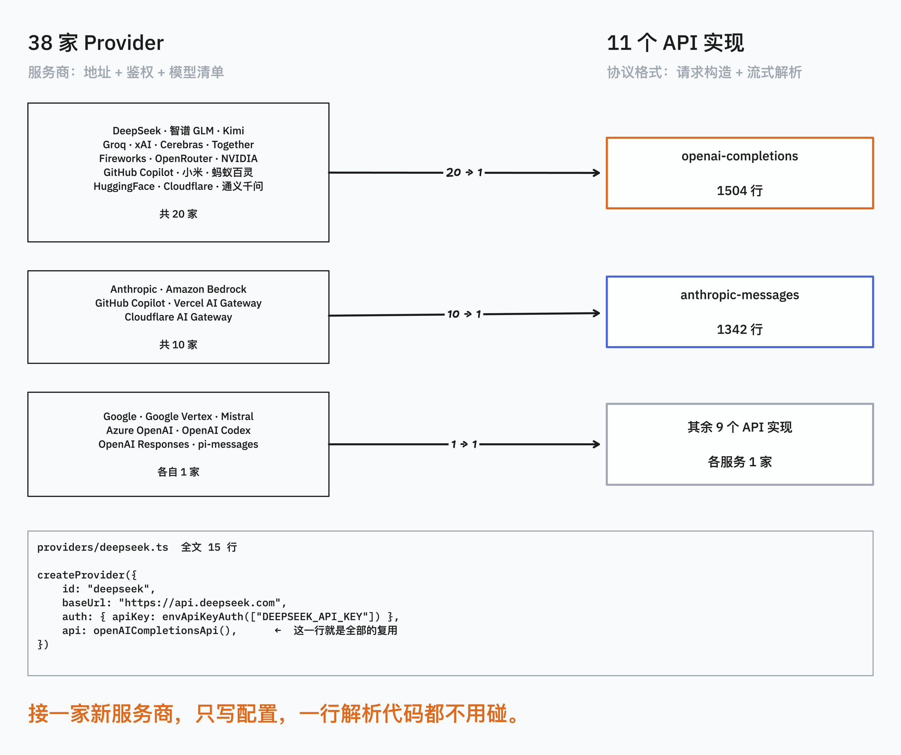
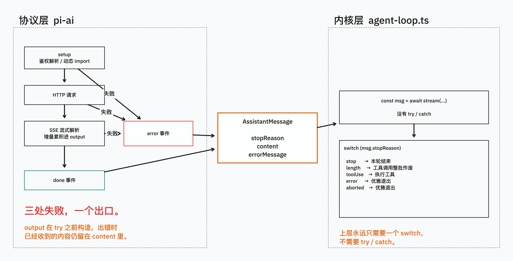

# 研读笔记 02：pi-ai 的统一 API 与错误契约

> 主源码：[api/lazy.ts](https://github.com/earendil-works/pi/blob/main/packages/ai/src/api/lazy.ts)（75 行）、[utils/event-stream.ts](https://github.com/earendil-works/pi/blob/main/packages/ai/src/utils/event-stream.ts)（88 行）、[types.ts](https://github.com/earendil-works/pi/blob/main/packages/ai/src/types.ts)（783 行）
> 基于 pi commit `5bc1c2c`（2026-07-25），`@earendil-works/pi-ai` 0.82.1；文中行号以该 commit 为准
> 对应文章：《38 家大模型，11 个实现就够了》｜对应代码：[steps/02](../steps/02-provider-api/)

## 一句话总结

pi-ai 用 **11 个 API 实现覆盖 38 家 provider**，靠的是把"协议格式"和"服务商"拆成两个独立维度；而上层 792 行的 runLoop 敢一行 try/catch 都不写，靠的是一条类型级契约：**stream 函数同步返回 EventStream，永远不 throw 也不 reject**，所有失败都变成流内的 error 事件和一条 `stopReason: "error"` 的 AssistantMessage。

第 1 篇结尾留的问题（内核凭什么用 `stopReason` 而不是 try/catch 做分支）答案就在这里。

## 数字全景



| 维度 | 数量 |
|---|---|
| API 实现（`api/*.lazy.ts`） | 11 |
| Provider（`providers/*.ts`） | 38 |
| `openai-completions` 一个实现服务的 provider | 20 家 |
| `anthropic-messages` 服务的 provider | 10 家 |
| 其余 9 个 API 各服务 | 1 家 |
| 接一家新 provider 的代码量 | 15 行 |

最短的 provider 文件 `providers/deepseek.ts` 全文 15 行：

```typescript
import { openAICompletionsApi } from "../api/openai-completions.lazy.ts";
import { envApiKeyAuth } from "../auth/helpers.ts";
import { createProvider, type Provider } from "../models.ts";
import { DEEPSEEK_MODELS } from "./deepseek.models.ts";

export function deepseekProvider(): Provider<"openai-completions"> {
	return createProvider({
		id: "deepseek",
		name: "DeepSeek",
		baseUrl: "https://api.deepseek.com",
		auth: { apiKey: envApiKeyAuth("DeepSeek API key", ["DEEPSEEK_API_KEY"]) },
		models: Object.values(DEEPSEEK_MODELS),
		api: openAICompletionsApi(),
	});
}
```

## 核心一：API 和 Provider 是两个维度

大部分人设计多模型支持时会按"服务商"建目录：`openai/`、`anthropic/`、`deepseek/`……每加一家写一遍流式解析。pi 拆成了两层：

- **API**（`types.ts:16` `KnownApi`）= 协议格式，11 种：`openai-completions`、`anthropic-messages`、`google-generative-ai`、`bedrock-converse-stream`、`pi-messages` 等
- **Provider**（`types.ts:34` `KnownProvider`）= 服务商，38 家：baseUrl + 鉴权方式 + 模型清单 + **指向一个 API 实现**

DeepSeek、Groq、Cerebras、xAI、Together、月之暗面、智谱、小米……这 20 家都兼容 OpenAI 的 completions 格式，于是共用同一份 1504 行的解析代码。真正需要单独写实现的只有协议本身不同的那几家。

`providers/` 目录下 38 个文件，绝大多数都在 15-30 行之间，因为它们只是配置。

## 核心二：绝不 reject 的错误契约



这是整个包最值得学的设计，分三层落地。

### 1. 类型签名层面就堵死了 catch 的入口

`types.ts:229`：

```typescript
export interface ProviderStreams {
	stream(model, context, options?): AssistantMessageEventStream;
	streamSimple(model, context, options?): AssistantMessageEventStream;
}
```

返回类型不是 `Promise<...>`。调用方无处 await，也就无处 try/catch。契约不是靠文档约定的，是靠类型系统强制的。

### 2. setup 阶段的失败：`lazy.ts:46`

鉴权解析、动态 import 模块这些异步准备工作，怎么塞进一个同步返回的函数里？

```typescript
export function lazyStream(
	model: Model<Api>,
	setup: () => Promise<AsyncIterable<AssistantMessageEvent>>,
): AssistantMessageEventStream {
	const outer = new AssistantMessageEventStream();

	setup()
		.then((inner) => forwardStream(outer, inner))
		.catch((error) => {
			const message = createSetupErrorMessage(model, error);
			outer.push({ type: "error", reason: "error", error: message });
			outer.end(message);
		});

	return outer;                      // 同步返回，setup 还在后台跑
}
```

先同步造一个空流返回出去，异步 setup 在后面跑。setup 失败不往上抛，转成一条 `stopReason: "error"` 的空 AssistantMessage（`lazy.ts:4` `createSetupErrorMessage`），push 进流里再 end。

`lazyApi()`（`lazy.ts:68`）把这个包装成 provider 的两个方法，模块在第一次调用时才加载，宿主的 import 缓存负责去重。**11 个 API 实现，用哪个才加载哪个**，冷启动不会把 openai + anthropic + google + bedrock 全部拉进内存。

### 3. 流传输中的失败：每个 api 实现的统一模式

以 `openai-completions.ts:196` 为例，11 个实现全长一个样：

```typescript
export const stream = (model, context, options): AssistantMessageEventStream => {
	const stream = new AssistantMessageEventStream();

	(async () => {                                    // 立刻启动，不 await
		const output: AssistantMessage = {              // try 之前就建好
			role: "assistant", content: [], usage: {...},
			stopReason: "stop", timestamp: Date.now(),
		};

		try {
			...鉴权、构造请求、发起 HTTP、逐块解析流、往 output.content 累积...
			stream.push({ type: "done", reason: output.stopReason, message: output });
			stream.end();
		} catch (error) {                               // L583
			// 清掉流式解析的临时字段
			for (const block of output.content) {
				delete block.index; delete block.partialArgs;
				delete block.customInput; delete block.streamIndex;
			}
			output.stopReason = options?.signal?.aborted ? "aborted" : "error";
			output.errorMessage = formatProviderError(normalizeProviderError(error));
			stream.push({ type: "error", reason: output.stopReason, error: output });
			stream.end();
		}
	})();

	return stream;                                    // L606 同步返回
};
```

四个细节值得单独讲：

1. **同步返回 + 异步 IIFE**：函数体里的 `async` 立即执行函数没有被 await，所以异常无法冒泡到函数外
2. **`output` 在 try 之前构造**：出错时已经解析出来的 text 和 toolCall 都还在 `output.content` 里，**部分结果不丢**。模型讲到一半断网，上层拿到的是"半条消息 + error 标记"，而不是空
3. **catch 里那段 delete**：`index`、`partialArgs`、`customInput`、`streamIndex` 是流式解析过程中的临时脚手架，正常路径走完会被清理，异常路径也必须清，否则脏字段会被持久化进对话历史
4. **`aborted` 和 `error` 分开**：用户主动 Ctrl+C 和真实故障是两种语义，靠 `signal?.aborted` 区分

### 4. 上层怎么消费：`agent-loop.ts:193`

```typescript
const message = await streamAssistantResponse(...);   // 不会 throw

if (message.stopReason === "error" || message.stopReason === "aborted") {
	await emit({ type: "turn_end", message, toolResults: [] });
	await emit({ type: "agent_end", messages: newMessages });
	return;                                             // 优雅退出，事件序列闭合
}
```

整个 792 行的 runLoop 里**没有一处 try/catch 包裹 stream 调用**。错误在这里只是五个 `StopReason` 之一（`types.ts:382`）：

```typescript
export type StopReason = "stop" | "length" | "toolUse" | "error" | "aborted";
```

第 1 篇讲的"输出被截断就整批作废"（`stopReason === "length"`）和这里是同一套机制。异常被降级成了普通的控制流分支。

## 核心三：64 行的 EventStream

`utils/event-stream.ts:4-67`，一个泛型 async iterator，mini-agent 可以直接照抄。

**push/waiting 双队列**是核心：

```typescript
push(event: T): void {
	if (this.done) return;
	if (this.isComplete(event)) {
		this.done = true;
		this.resolveFinalResult(this.extractResult(event));
	}
	const waiter = this.waiting.shift();
	if (waiter) waiter({ value: event, done: false });   // 消费者在等 → 直接投递
	else this.queue.push(event);                         // 没人等 → 先缓存
}
```

生产快于消费时事件进 `queue`；消费快于生产时消费者的 resolve 函数进 `waiting`。两个队列永远只有一个非空。

**两个泛型钩子**把"什么算结束"和"结果怎么取"抽象出去，特化时才填（`event-stream.ts:69`）：

```typescript
export class AssistantMessageEventStream extends EventStream<AssistantMessageEvent, AssistantMessage> {
	constructor() {
		super(
			(event) => event.type === "done" || event.type === "error",   // error 也算完成
			(event) => event.type === "done" ? event.message : event.error,
		);
	}
}
```

`done` 和 `error` 都算流的正常结束，而且 error 事件携带的 `error` 字段本身就是最终结果。**错误不是异常，是一种结束状态**，这个判断在类型层面就写死了。

**`result()` 和迭代解耦**：调用方可以只 `for await` 拿增量事件做 UI 渲染，也可以只 `await stream.result()` 拿最终消息，两者互不干扰。`agent-loop.ts:317` 用前者驱动 emit，`agent-loop.ts:363` 用后者拿返回值。

## 值得写进文章的设计点

### A. 主线（文章 2 的骨架）

1. **API ≠ Provider 的二维拆分** —— 11 vs 38 的数字，DeepSeek 15 行接入
2. **类型签名堵死 catch 入口** —— 返回值不是 Promise，契约由编译器强制
3. **三层错误收敛** —— setup 失败（lazy.ts）、流中失败（各 api 实现）、上层消费（stopReason 分支）
4. **部分结果不丢** —— output 在 try 外构造，这是和"直接 throw"最本质的区别
5. **懒加载** —— 用哪个 API 才 import 哪个

### B. 细节控向（短推或番外）

- catch 里清理 `partialArgs` 等流式脚手架字段，异常路径也要保证输出干净
- `aborted` vs `error` 的语义区分
- EventStream 的 push/waiting 双队列（选题池已记，本篇可展开）
- `result()` 与 `for await` 双消费口

## mini-agent 实现清单（steps/02）

从 steps/01 的 110 行往上加，把这条契约实现了一遍，代码在 [steps/02](../steps/02-provider-api/)：

- [x] 抄 `EventStream`（泛型 + isComplete/extractResult 钩子）
- [x] `stream()` 改成同步返回 EventStream，内部异步 IIFE + try/catch
- [x] `output` 在 try 外构造，验证断流时部分内容保留
- [x] `StopReason` 五个值落地，主循环改成 stopReason 分支而不是 try/catch
- [x] 抽出 provider 配置（baseUrl / apiKey env / models），DeepSeek、智谱、Kimi 共用同一份 openai-completions 解析
- [x] 实测：故意填错 API key、中途断网、Ctrl+C，三种情况分别落到 error / error / aborted

**演示脚本**：把 API key 改错一个字符，agent 不崩溃，打印出 `stopReason: error` 和 provider 返回的原始错误信息。这是视频里最直观的一幕。

## 其他线索（后续文章用）

- `utils/retry.ts` 和 `utils/provider-retry.ts`：重试策略在哪一层，和"绝不 reject"如何共存
- `compat/` 目录：同一个 API 格式下各家的方言差异怎么抹平
- `models.generated.ts`：模型清单是生成的，怎么维护 38 家的模型元数据
- `auth/`：OAuth 和 apiKey 两条鉴权路径，为什么每轮都要重新解析（选题池已记）
